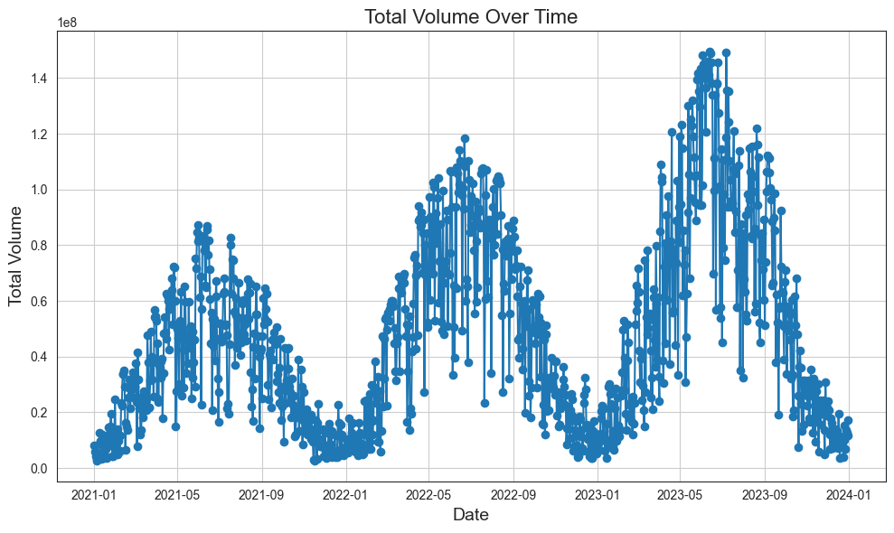

# Energie Opwek
This repository contains all the notebooks for the Data Driven Innovation Challenge. For this challenge we decided to predict renewable energy production in the Netherlands. This data challenge is made by Marjolein van der Eerden and Esther Wolfs.

## Table of contents
[Idea](#idea)
[Approach](#approach)
[Results](#results)
[Folder Structure](#folder-structure)

## Idea
The original idea was to create a predictive tool for forecasting energy congestion in power grids or other energy networks. For would involve analysing real-time and historical energy data, to detect bottlenecks in the energy flow and provide actionable insights for grid operators to prevent or mitigate congestion issues. However, due to the necessary energy consumption data not being publicly available, this idea is not feasible. Instead, the focus shifted to predicting renewable energy production, specifically solar and wind energy. 

## Approach
To predict renewable energy we took the following steps:

#### 1. Data Requirements

**Essential Data**:
- **Energy production** data for the Netherlands, preferably hourly but at least daily
- **Energy consumption** data for the Netherlands, preferably hourly but at least daily
- **Weather data** for the Netherlands, preferably hourly but at least daily

**Nice-to-Have Data**:
- Number of solar panels in the Netherlands
- Total number of windmills in the Netherlands
- Total number of electric vehicles in the Netherlands

These datasets could help improve predictions, since all of these influence the total energy production and consumption. 

#### 2. Data Collection
The main dataset we used is the energy production dataset from <https://ned.nl>. This contains the total energy production per hour in the Netherlands for multiple different energy sources. Unfortunately, they only have energy production data and the energy consumption data is not yet available on their data portal. We tried looking for other sources of energy consumption data for the Netherlands, but we only found a cbs dataset that contained monthly (calculated) energy consumption data. For this reason we mainly focused on the energy production data. 

For the nice-to-have data we found some datasets that contained the total number of solar panels and windmills in the Netherlands at the end of each year, we used these datasets for some analysis. We did not find a useful source for the total amount of electric vehicles, but also decided to not include this anyway, since we also don't have the right energy consumption data.

#### 4. Data Preparation
We started with combining these datasets and then cleaning them, so they could be used for data analysis. This also includes handling the missing values.

#### 5. Modelling
After doing the analysis we started on modelling. We decided to focus on two different energy sources, solar energy production and wind energy production. After doing some research we found a few models we could try. These models include:

- **Solar Energy Production**:
    - LSTM
    - BiLSTM
    - CNN
    - SARIMA (statistical model)

- **Wind Energy Production**:
    - LSTM
    - RNN
    - GRU

All of these models are also evaluated and compared, to find the best performing model.

## Results
Since we tried to predict two different energy sources we will split the results.

### Solar Energy

#### EDA

While analysing the data we discovered the total solar energy production has increased over time. We also found out the solar energy production is higher in the summer compared to the winter.

#### SARIMA
For the solar energy predictions the SARIMA model performed the best. We were able to get an R² score of 0.945 on the test set and 0.955 on the train set. These results are quite high, and because the R² for the train and test set are also really close to each other means.


### Deep Learning
Unfortunately the deep learning models we tried for this dataset did not produce any good results.

#### LSTM

In this graph we can see the validation loss is all over the place, this means the model is not effectively training. There is also a high difference in the train and test R² scores: the train score is 0.937 and the test score is 0.839. This means the model is overfitted.

#### BiLSTM

This time early stopping was used to prevent overfitting. The validation loss is closer to the training loss, but it is still not as stable as we want, making the model unusable. Comparing the train and test R² scores (0.867 for the train set and 0.834 for the test set) we can see the model is less overfitted than the regular LSTM model.

### Wind Energy
#### EDA


Based on these graphs we can conclude that there is no seasonality in the wind energy production data. The wind speed is similar for all the seasons.

#### LSTM

#### RNN

#### GRU

## Folder Structure
The project is divided into the following folders. The data used in the project can be found in the data folder, this contains both the raw and cleaned data. The data_prep folder contains all the notebooks we created for cleaning the data, the eda folder contains all the notebooks where we did the EDA and finally the models folder contains the notebooks used for creating and evaluating the models.
```
.
└── root/
    ├── data/
    │   ├── ConsumptionData # energy consumption data
    │   ├── Model # data used for modelling
    │   ├── Other # other data
    │   ├── ProductionData # energy production data
    │   └── Weather # weather data
    ├── data_prep/
    │   ├── ConsumptionDataCleaning.ipynb # Esther
    │   ├── JoiningProductionData.ipynb # Marjolein
    │   ├── ProductionDataCleaning.ipynb # Marjolein
    │   ├── SolarPanels.ipynb # Esther
    │   ├── WeatherDataCleaning.ipynb # Marjolein
    │   └── WindmillsDataCleaning.ipynb # Marjolein
    ├── eda/
    │   ├── ConsumptionData.ipynb # Esther
    │   ├── ProductionEDA.ipynb # Marjolein
    │   ├── SolarProduction.ipynb # Esther
    │   └── WindvsWindmillsEDA.ipynb # Marjolein
    ├── models/
    │   └── SolarEnergyPrediction.ipynb # Esther
    │   └── WindEnergyPrediction.ipynb # Marjolein    
    ├── images/ # output images for readme 
    │  
    └── README.md
```

## References
We used a number of different sources as research into energy production and models we wanted to use.

**Datasets used**:
* Energy consumption data (CBS): <https://www.cbs.nl/nl-nl/cijfers/detail/84575NED?q=energie%20verbruik>
* Energy production data (NED): <https://ned.nl>
* Solar panels (CBS): <https://opendata.cbs.nl/#/CBS/nl/dataset/85005NED/table>
* Weather data (KNMI): <https://www.knmi.nl/nederland-nu/klimatologie/uurgegevens>
* Windmills data (CBS): <https://opendata.cbs.nl/statline/#/CBS/nl/dataset/70960ned/table?dl=577D1>

**Sources**:
* Gaslicht: <https://www.gaslicht.com/nieuws/bij-welk-weer-wekken-zonnepanelen-de-meeste-energie-op#:~:text=Hogere%20temperatuur%3A%20lagere%20opbrengst,maar%20temperaturen%20van%2030%20graden.>
* SARIMA (Geeks for geeks): <https://www.geeksforgeeks.org/sarima-seasonal-autoregressive-integrated-moving-average/>
* LSTM (Geeks for geeks): <https://www.geeksforgeeks.org/deep-learning-introduction-to-long-short-term-memory/>
* CNN for time series: <https://thejaskiran99.medium.com/unlocking-the-potential-of-convolutional-neural-networks-cnns-in-time-series-forecasting-b2fac329e184>
* RNN (Geeks for geeks): <https://www.geeksforgeeks.org/introduction-to-recurrent-neural-network/>
* RNN Tutorial: <https://www.datacamp.com/tutorial/tutorial-for-recurrent-neural-network>
* GRU (Geeks for geeks): <https://www.geeksforgeeks.org/gated-recurrent-unit-networks/>
* Optuna: <https://medium.com/data-and-beyond/master-the-power-of-optuna-a-step-by-step-guide-ed43500e9b95>